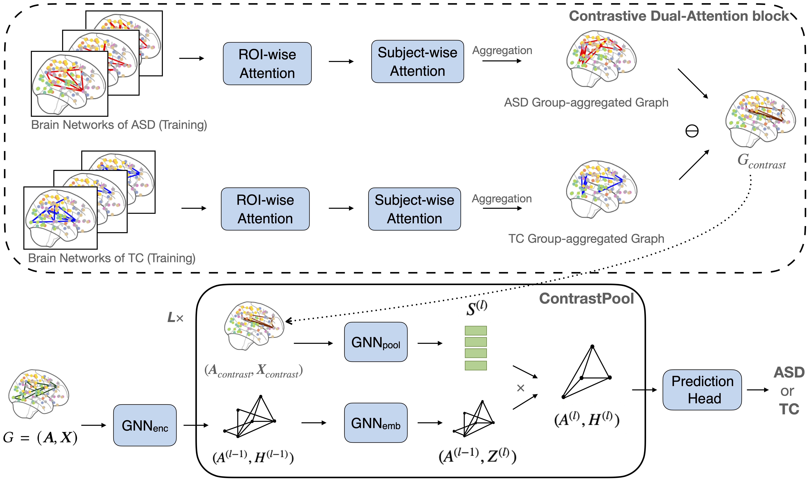

# ContrastPool
This is the official PyTorch implementation of ContrastPool from paper 
*"Contrastive Graph Pooling for Explainable Classification of Brain Networks"* submitted to IEEE Transactions on Medical Imaging (TMI) 2024.

Link: [Arxiv](https://arxiv.org/abs/2307.11133).




## Data
All Preprocessed data used in this paper are published in [this paper](https://proceedings.neurips.cc/paper_files/paper/2023/file/44e3a3115ca26e5127851acd0cedd0d9-Paper-Datasets_and_Benchmarks.pdf). 
Data splits and configurations are stored in `./data/` and `./configs/`. If you want to process your own data, please check the dataloader script `./data/BrainNet.py`.

## Usage

Please check `baseline.sh` on how to run the project.

## Citation

If you find this code useful, please consider citing our paper:

```
@article{xu2023contrastive,
  title={Contrastive Graph Pooling for Explainable Classification of Brain Networks},
  author={Xu, Jiaxing and Bian, Qingtian and Li, Xinhang and Zhang, Aihu and Ke, Yiping and Qiao, Miao and Zhang, Wei and Sim, Wei Khang Jeremy and Guly{\'a}s, Bal{\'a}zs},
  journal={arXiv preprint arXiv:2307.11133},
  year={2023}
}
```

## Contact

If you have any questions, please feel free to reach out at `jiaxing003@e.ntu.edu.sg`.
